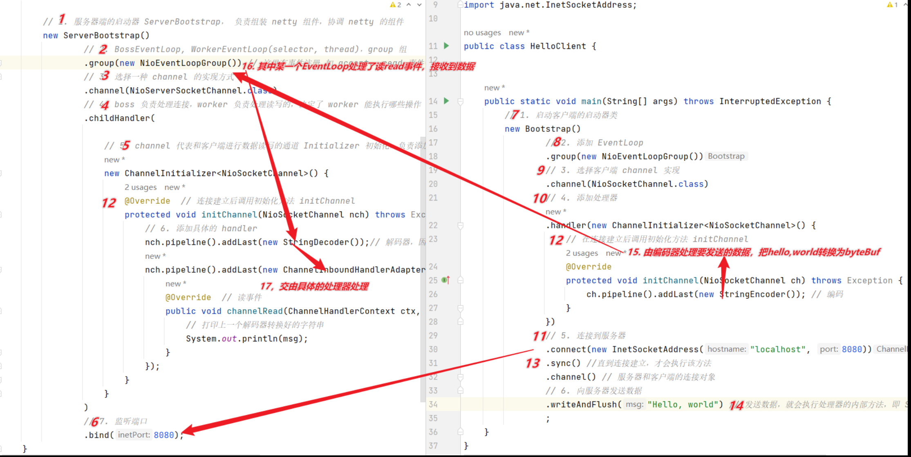

# netty-study

* 多路复用

  单线程可以配合 selector 完成对多个 channel 可读可写事件的监控，这称之为多路复用。

  - 多路复用只针对网络 io

* netty 执行流程

# 自定义协议要素

- 魔数，用来再第一时间判定是否是无效数据包
- 版本号，可以支持协议的升级
- 序列化算法，消息正文到底采用那种序列化反序列化方式，可以由此扩展。例如 json，protobuf,hessian,jdk
- 指令类型，是登录、注册、单聊、群聊..跟业务相关
- 请求序列号，为了双工通信，提供异步能力
- 正文长度
- 消息正文

# 客户端断开连接
   
  服务端需要处理两个事件：正常断开，异常断开
  QuitHandler

# 连接假死

原因：
- 网络设备出现故障，例如网卡，机房等，底层的 TCP 连接已经断开了，但应用程序没有感知到，仍然占用着资源
- 公网网络不稳定，出现丢包。如果连续出现丢包，这时现象就是客户端数据发不出去，服务端也一直收不到数据，就这么一直耗着
- 应用程序线程阻塞，无法进行数据读写

问题
- 假死的连接占用的资源不能自动释放
- 向假死的连接发送数据，得到的反馈时发送超时